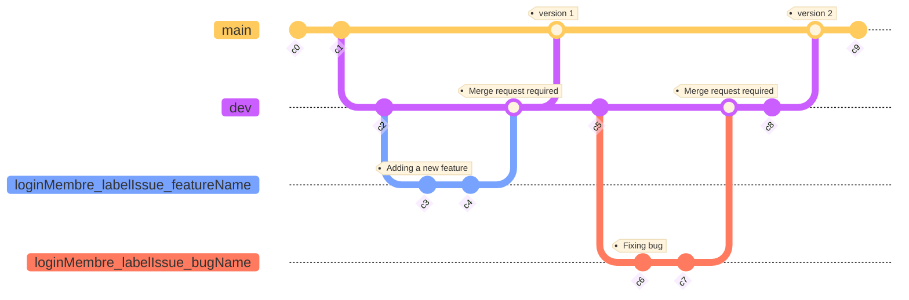

# Règles et Valeurs communes (01/10)

Tout membre du groupe est prié de respecter les règles communes suivantes selon son rôle :

## Communication et Collaboration

- Tout membre de l'équipe doit être transparent dans sa **communication**. En cas de blocage ou de difficulté, il est impératif de solliciter de l’aide au plus tôt afin de ne pas retarder le projet.

- L’utilisation de **Discord** est encouragée pour favoriser une collaboration fluide et continue.

- Les décisions importantes concernant le projet (choix techniques, délais, etc.) doivent être partagées et discutées au sein de l’équipe pour s’assurer que tous les membres soient alignés.

## Valeurs communes

- La **collaboration** est une valeur fondamentale. Tous les membres doivent faire preuve d’entraide et travailler ensemble pour atteindre les objectifs du projet.

- La **qualité du code** doit toujours primer sur la rapidité d’exécution.

- Le **respect des délais** est essentiel pour garantir l'avancement du projet. Chaque membre doit s'efforcer de terminer les tâches assignées dans les délais impartis.

- La **formation continue** est encouragée. Chaque développeur doit veiller à se former sur les technologies utilisées et chercher à améliorer ses compétences.

## Processus SCRUM

- Chaque séance de projet débute par un "**daily standup**" (max. 15 minutes) afin d'évoquer le travail réalisé lors de la dernière séance, celui de la séance actuelle et soulever les difficultés rencontrées. Cette séance est organisée par le **Scrum Master**. Tous les autres membres de l'équipe assistent et participent à cette réunion.

- Le **Scrum Master** est chargé de créer les **GitHub issues**, les **branches Git** associées et les assigner à un membre de l'équipe. Il s'assure également que l'issue est attachée au tableau **Kanban** du projet.

- Le **Scrum Master** veille à la cohérence de l'état du tableau **Kanban** du projet, en s’assurant que les tâches soient bien classées, mises à jour régulièrement, et reflètent l’avancement réel du projet.

- Les **Sprint Review** et **Sprint Retrospective** sont organisées par le **Scrum Master** à la fin de chaque sprint pour revoir le travail réalisé, discuter des succès et points d’amélioration, et ajuster le processus pour les sprints à venir.

## Usage de Git

- Tout **développeur** assigné à une **GitHub issue** est chargé de réaliser le développement nécéssaire sur la **branche Git** associée.

- Une **branche Git** suit la nomenclature suivante `loginMembre_labelIssue_featureName`.
```
/* Commandes Git à saisir par le développeur pour atteindre sa branche de travail */

git fetch origin
git checkout loginMembre_labelIssue_featureName
```

- Tout **développeur** ayant terminé son développement, créer une **Pull request** depuis l'interface GitHub dédiée.

- Une **Pull request** est comparée à la branche `dev` pour **l'ajout et/ou la correction d'une fonctionnalité**. Autrement elle est comparée à la branche `main` pour le **déploiement d'une nouvelle version de l'application**.

- Une **Pull request** est **revue en binôme** avec le **Lead Front/Back**, puis par le **Chef de Projet** ou le **Scrum Master**. 

- L'organisation des branches Git du projet doit suivre une structure claire et logique, permettant une meilleure gestion des nouvelles fonctionnalités et des corrections de bugs. Le schéma ci-dessous illustre le flux devant être respecté :


## Développement

- Tout **développeur** doit veiller à nommer correctement ses **variables**. Par convention la nomenclature `camelCase` est utilisée.

- Tout **développeur** doit rédiger des **commentaires** sur ce que son code "ne dit pas" explicitement.

- Lors de la **revue de code**, une attention particulière est portée à la **lisibilité**, la **performance** et la **maintenabilité** du code.
